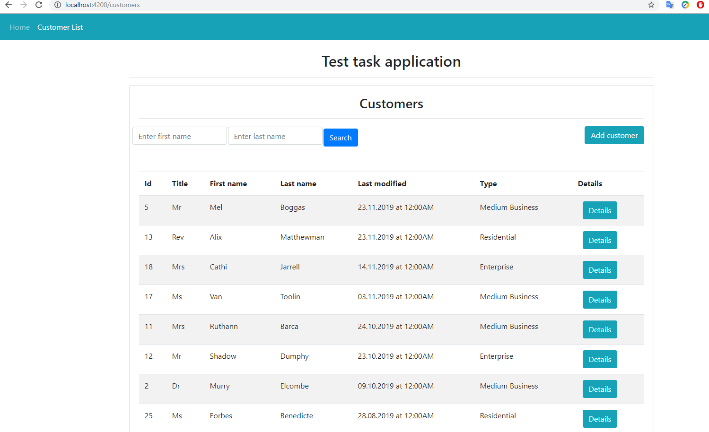
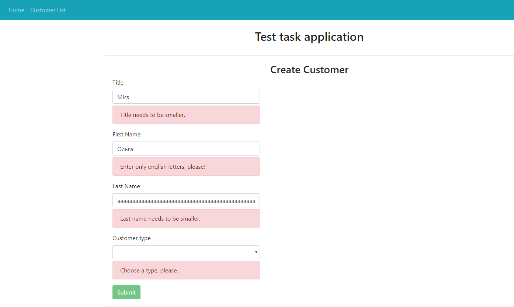
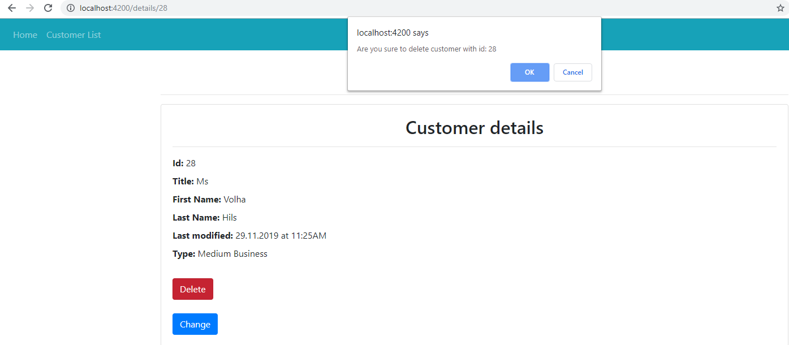

# Test task for Netcracker

The simple information system for managing and searching a customer base.  
Full-stack application using Spring Boot as backend provider and Angular 8 
as a fronted provider which performs different CRUD operations on a Customer entity.
## Technologies
Project is created with:  
* JDK: Open JDK 11
* Build tool: Maven
* String Boot: 2.2.1
* Hibernate: 5.1.0
* Tomcat: 9.0.27
* PostgreSQL: 10
* Flyway: 6.0.3
* Swagger: 2.9.2
* Lombok: 1.18.10
* Angular: ~8.2.14

## Screenshots
##### Customers

##### Add a customer with validation

##### Delete the customer with confirmation

### Used resources 
* [For Hibernate](https://www.baeldung.com/hibernate-5-spring)
* [Configure Hibernate ](https://www.springboottutorial.com/hibernate-jpa-tutorial-with-spring-boot-starter-jpa)
* [Angular](https://dzone.com/articles/java-8-springboot-angularjs-bootstrap-springdata-j)
* [For writing Angular CRUD operation](https://www.javaguides.net/2019/06/spring-boot-angular-8-crud-part-1-develop-springboot-crud-rest-apis.html)
* [Spring Data Jpa](https://www.javaguides.net/2018/09/spring-data-jpa-auditing-with-spring-boot2-and-mysql-example.html)
* [For wrinig ModelMapper](https://habr.com/ru/post/438808/)

